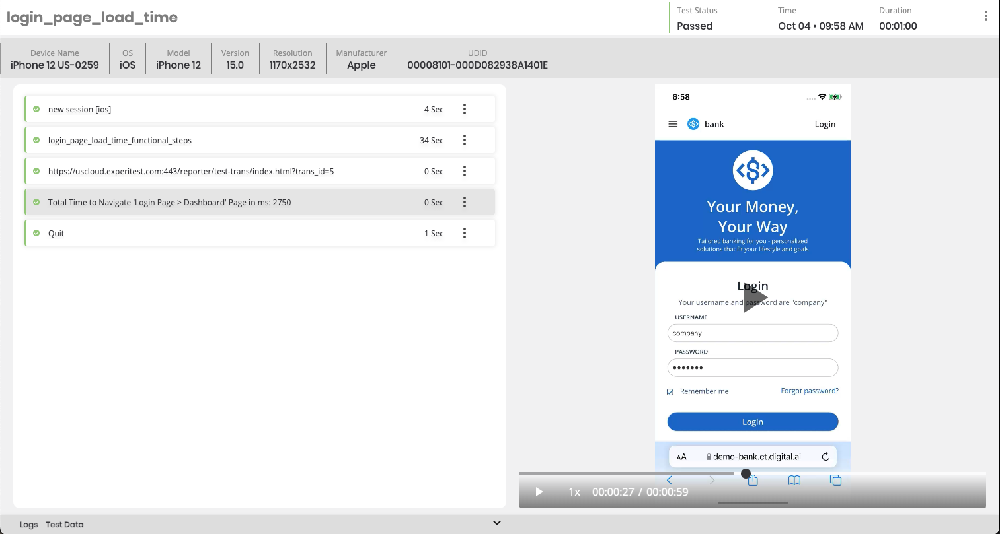
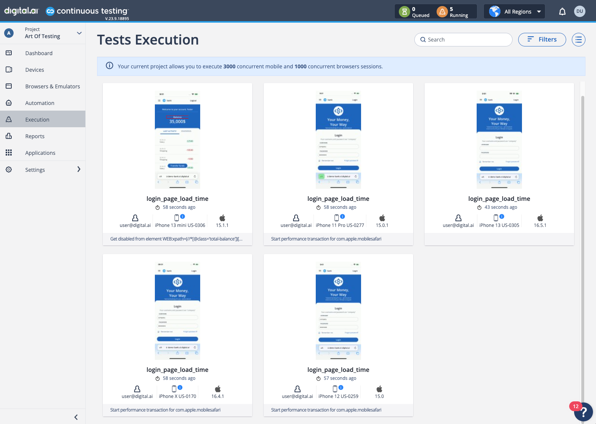

# DAI-CT-Performance-Tests-on-Mobile-Sample

This repository have a few examples on the type of data we can capture as part of Performance Testing with Digital.ai's Continuous Testing solution.

I'll be referring to "Performance Transaction", which can be seen as a user flow that we want to capture, for example, launching an Application, logging into an Application, or making a Payment can all be considered individual Performance Transactions.

Let's take a look at an example on how we can capture metrics from Performance Transactions as part of our Functional Appium Scripts.

### Technology

- Programming Language: Java
- Test Framework: TestNG
- Compiler: Maven

### Flow

The logic of A Functional Appium Script may go like this:

- Launch Application
- Login to the Application
- Make a Payment
- Logout from the Application

For this flow, we can break it down to 4 Performance Transactions. Let's take a look at one Performance Transaction:

- Step 1 - Start Performance Transaction
- Step 2 - Launch Application
- Step 3 - Verify user has landed on the Login Page
- Step 4 - Stop Performance Transaction

For a full example and walkthrough of steps, see **E2E_Flow.java** file.

### Result

Digital.ai's Continuous Testing platform generates a Video Report by default as part of the Functional Appium Script. When running Performance Transactions, separate reports are generated specific to a Performance Report.

Here is an example view of our out-of-the box Reporting Dashboard for the Functional Appium Test Results:

Opening up an individual Automated Report, I can see the entire Test Flow, and as a new line, the URL link to the Performance Transaction that relates to this particular Test:

Each Performance Transaction when opened allows us to see additional granular information related to Performance Transaction, such as CPU, Memory, Battery & Network:

Apart from viewing the individual Performance Transactions report one by one, we can also look at the overall transactions that ran under the Transactions view to help us understand trends & potential bottlenecks. In this particular example, we can see that the Speed Index was slightly higher on higher iOS Versions:

### Visual References

Performance Transactions running across 5 Devices in parallel:

