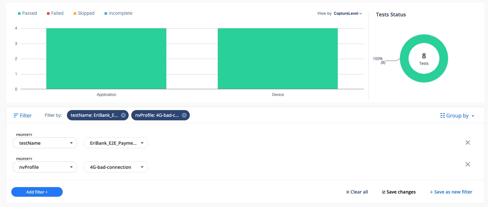
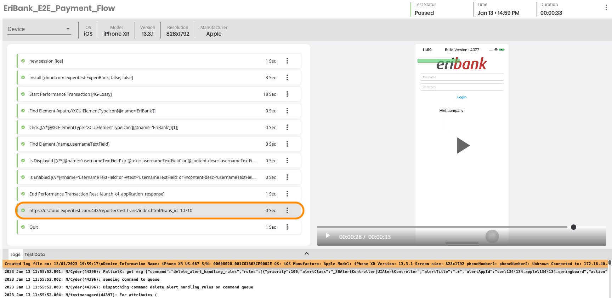
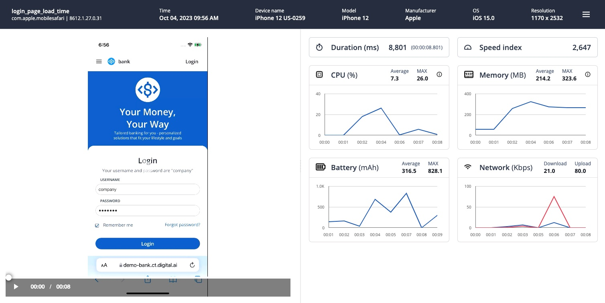
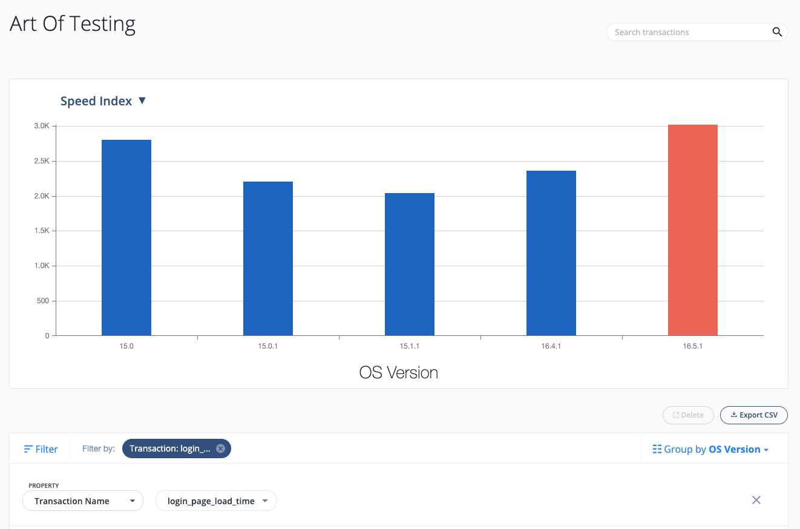

# DAI-CT-Performance-Tests-on-Mobile-Sample

In this example we will review how we can capture Performance Transactions as part of our Functional Appium Scripts.

- Programming Language: Java
- Test Framework: TestNG
- Compiler: Maven

The logic of the functional script goes like this:

- Initialize a session on a Mobile Device once
- Run 4 tests sequentially, one after another
  - Test 1 - Launch Application
  - Test 2 - Login to the Application
  - Test 3 - Make a Payment
  - Test 4 - Logout from the Application
  - Tear Down the session

Let us look at how we can include Performance Transactions as part of the End 2 End functional test.

To break the flow down further for simplicity, here's what would happen in an example flow:

- Step 1 - Install Application
- Step 2 - Start Performance Transaction
- Step 3 - Click on the App Icon on the Home Page
- Step 4 - Verify user has landed on the Login Page
- Step 5 - Stop Performance Transaction

For a full example and walkthrough of steps, see **E2E_Flow.java** file.

What we can achieve with this approach is gaining the ability to easily filter down results and view relevant information.

Here is an example view of Automated Appium Tests that has been executed and filtered down:

Opening up an individual Automated Report, I can see the entire Test Flow, as well as Performance Transactions captured:

Each Performance Transaction when opened allows us to see additional granular information related to performance:

Apart from viewing the individual reports one by one, we can also look at the overall transactions that ran under the Transactions view:

